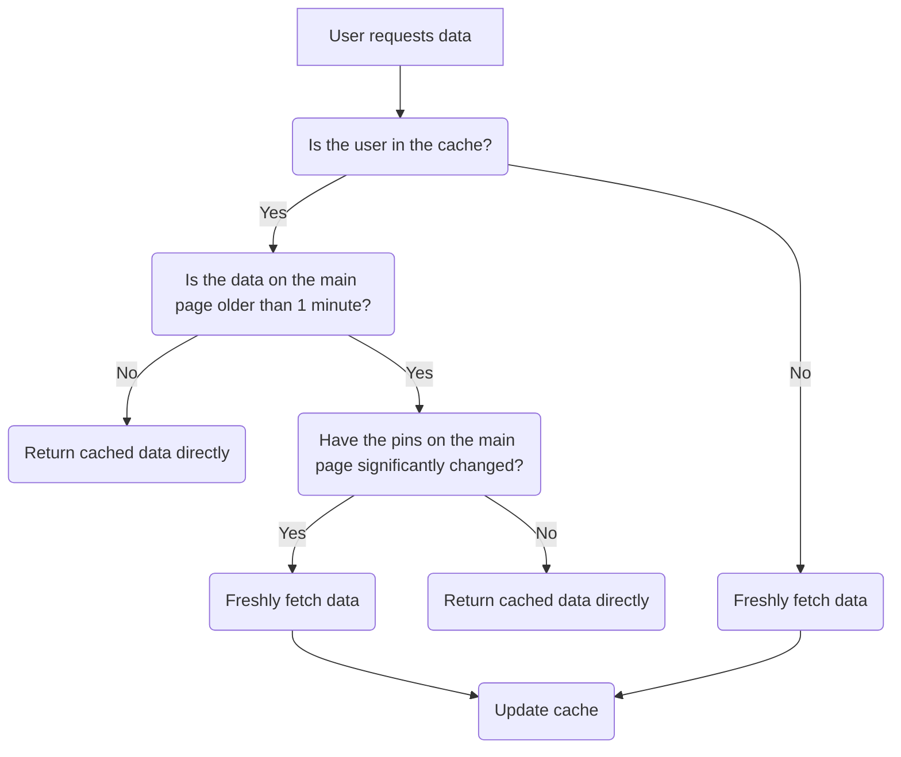

# GitHub Pins Overview by DNA

Hey, this is a simple project i made for fun, which displays the pinned repositories of a GitHub user in a simple and clean way

A live version of the project can be found [here](https://gh-pins.dnascanner.de/pinned/dnascanner)

⚠️ **Note:** The page might take a few seconds to load, as it grabs the data right of the github site instead of an API (which doesn't exist unfortunately). This however is due to <u>the server's</u> own internet connection and not due to the code itself

## How to use

1. Clone the repository
2. Start the backend

```powershell
deno run -A main.ts
```

3. Open frontend in your browser:

### Routes

| Route               | Description                                                                       |
| ------------------- | --------------------------------------------------------------------------------- |
| `/pinned/:username` | Displays the pinned repositories of the given user (returns an HTML document)     |
| `/raw/:username`    | Returns the pinned repositories in JSON format                                    |
| `/image/:username`  | Returns a rendered image (with transparent background) of the pinned repositories |

## Caching


