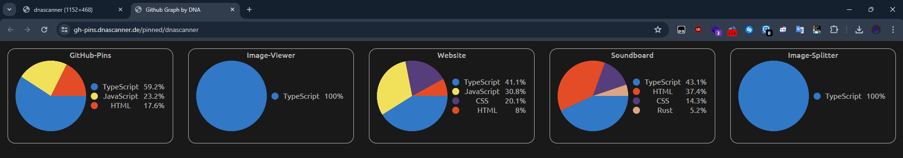
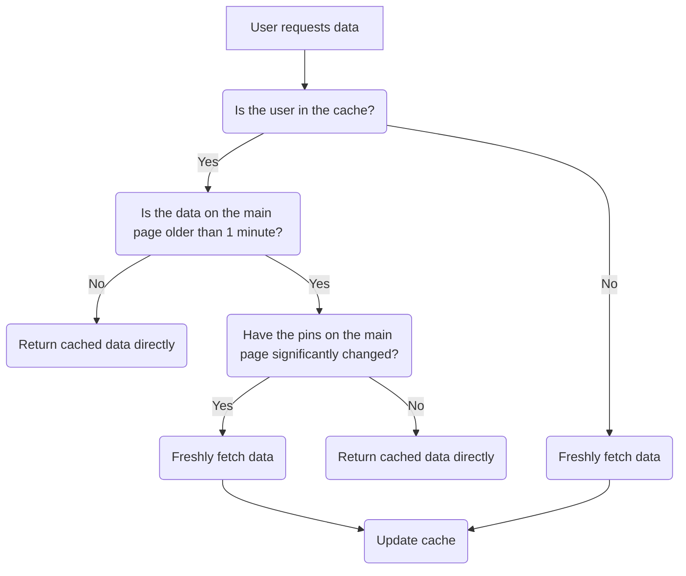

# GitHub Pins Overview by DNA

Hey, this is a simple project i made for fun, which displays the pinned repositories of a GitHub user in a simple and clean way

A live version of the project can be found [here](https://gh-pins.dnascanner.de/pinned/dnascanner)

⚠️ **Note:** The page might take a few seconds to load, as it grabs the data right of the github site instead of the API (which doesn't exist unfortunately). This however is due to <u>the server's</u> personal internet connection

## How to use

1. Clone the repository
2. Start the backend

```powershell
deno run -A main.ts
```

3. Open frontend in your browser:

- https://gh-pins.dnascanner.de/pinned/dnascanner


- https://gh-pins.dnascanner.de/raw/dnascanner
Responds with just the pinned repositories in JSON format like this:

```ts
[
	{
		name: "GitHub-Pins",
		url: "https://github.com/DNAScanner/GitHub-Pins",
		languages: [
			{
				name: "TypeScript",
				part: 0.592,
				color: "#3178C6",
			},
			{
				name: "JavaScript",
				part: 0.232,
				color: "#F1E05A",
			},
			{
				name: "HTML",
				part: 0.176,
				color: "#E34C26",
			},
		],
	},
];
```

- https://gh-pins.dnascanner.de/image/dnascanner?cols=3
Simply returns a rendered image of the pinned repositories like this:


## Caching


